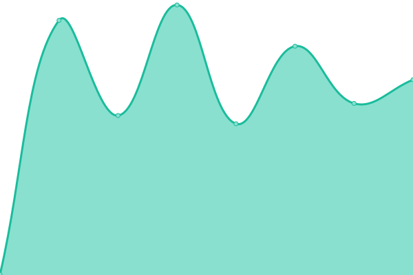
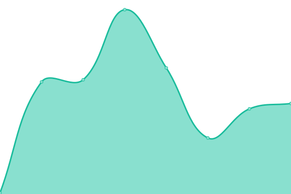

# [📈 Live Status](https://demo.upptime.js.org): <!--live status--> **🟩 All systems operational**

This repository contains the open-source uptime monitor and status page for [Upptime](https://upptime.js.org), powered by [Upptime](https://github.com/upptime/upptime).

With [Upptime](https://upptime.js.org), you can get your own unlimited and free uptime monitor and status page, powered entirely by a GitHub repository. We use [Issues](https://github.com/upptime/upptime/issues) as incident reports, [Actions](https://github.com/gerrited/upptime/actions) as uptime monitors, and [Pages](https://demo.upptime.js.org) for the status page.

<!--start: status pages-->
<!-- This summary is generated by Upptime (https://github.com/upptime/upptime) -->
<!-- Do not edit this manually, your changes will be overwritten -->
<!-- prettier-ignore -->
| URL | Status | History | Response Time | Uptime |
| --- | ------ | ------- | ------------- | ------ |
|  [Blog](https://gerrit.codes) | 🟩 Up | [blog.yml](https://github.com/gerrited/upptime/commits/HEAD/history/blog.yml) | 

 349ms
     
 | 

<a href="https://status.g11s.cc/history/blog">100.00%</a>
    

|  [k3s WeatherForecast](https://k3s.g11s.cc/WeatherForecast) | 🟩 Up | [k3s-weather-forecast.yml](https://github.com/gerrited/upptime/commits/HEAD/history/k3s-weather-forecast.yml) | 

 465ms
     
 | 

<a href="https://status.g11s.cc/history/k3s-weather-forecast">99.59%</a>
    

|  [Google](https://www.google.com) | 🟩 Up | [google.yml](https://github.com/gerrited/upptime/commits/HEAD/history/google.yml) | 

 347ms
     
 | 

<a href="https://status.g11s.cc/history/google">100.00%</a>
    

|  [Wikipedia](https://en.wikipedia.org) | 🟩 Up | [wikipedia.yml](https://github.com/gerrited/upptime/commits/HEAD/history/wikipedia.yml) | 

 180ms
     
 | 

<a href="https://status.g11s.cc/history/wikipedia">100.00%</a>
    

|  [Hacker News](https://news.ycombinator.com) | 🟩 Up | [hacker-news.yml](https://github.com/gerrited/upptime/commits/HEAD/history/hacker-news.yml) | 

 237ms
     
 | 

<a href="https://status.g11s.cc/history/hacker-news">100.00%</a>
    

<!--end: status pages-->

[**Visit our status website →**](https://demo.upptime.js.org)

## 📄 License

- Powered by: [Upptime](https://github.com/upptime/upptime)
- Code: [MIT](./LICENSE) © [Upptime](https://upptime.js.org)
- Data in the `./history` directory: [Open Database License](https://opendatacommons.org/licenses/odbl/1-0/)
